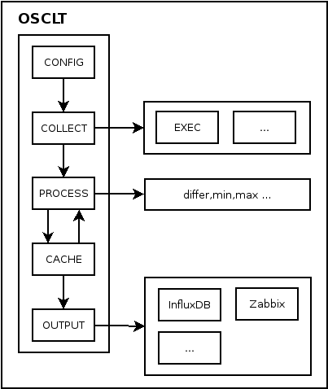

# 设计结构

对于监控领域，已经存在许多数据采集的软件，如zabbix agent，osquery，telegraf，collectd，nagios等等，还有阿里等大公司开源的类似产品。这些软件都是为服务器监控的设计的。而随着iot的发展，物联网设备必然也会有运维的需求。而上述这些软件或多或少都存在一些缺点，例如：

* 采用顺序调度，执行时间会依次推迟（zabbix和osquery）。
* 结构复杂，难于扩展（osquery和telegraf）。
* 库依赖多，难于部署（因为客户环境复杂，如osquery，collectd）。
* 体积大，难于应用到嵌入式设备上（osquery和telegraf）。

针对于这些软件目前存在的问题，以及物联网运维潜在的市场，我设计了osclt，它并不是完全的从零开始，而是采纳现有软件的优点，规避缺点，设计出一个我期望的尽可能完美的方案。

**osclt的设计目标是做到简单,可靠，易于扩展。能够适用于不同的监控领域。**

* 简单：功能简单，只负责数据采集和数据发送，不做过多的处理。同时体积小巧，以便能够部署到各种嵌入式设备上。
* 可靠：程序能够稳定运行，数据准确，不丢数据。
* 易于扩展：增加新功能简单，方便用户添加自定义采集功能。

## 程序结构

osclt的结构图如下：

osclt主要由config，collect，process，cache和output五个核心功能模块组成，collect，process和output模块可由插件扩展。核心模块的作用分别如下：

### config模块

负责解析osclt.conf和osclt.conf.d目录下的配置文件，用于初始化程序全局配置和各个模块的配置。collect模块根据配置启动不同的采集功能模块，process根据配置对数据进行加工处理，output根据配置输出到不同的目标。

### collect模块

## 数据格式
